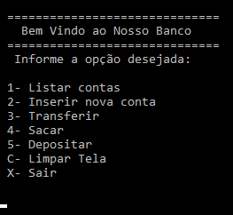

# Conta.Bancaria

     
Projeto DIO conta bancária .NET

Nesse projeto de conta bancária introduzido no .NET, começamos a criação do projeto

Em seguida, criamos um classe chamada Conta onde inserimos os atributos de Saldo, Crédito, Nome
e um Enum do TipodeConta(1= Pessoa Física) (2= Pessoa Jurídica)

Logo Após criamos os métodos construtores para a Conta, Sacar, Depositar, Transferir e finalmente
um método sobrescrito (override) ToString, retornando uma string com o Tipo de conta, Saldo, nome e crédito.
Assim, finalizando a classe Conta.

Após a classe conta ser finalizada, implementamos ao programa um método de Opção do usuário
criando menu com uma estrutura condicional switch/case que ira percorrer os métodos :
ListarConta, InserirConta, Transferir, Sacar, Depositar, ou sair.

Agora criamos uma List<conta> simulando um banco de dados cadastrando as novas contas e seus atributos 
Nome, Saldo e Credito.
e após em cada método criado fazemos a indexação e assim permintindo a simulação bancária.

